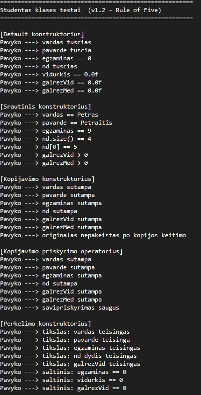
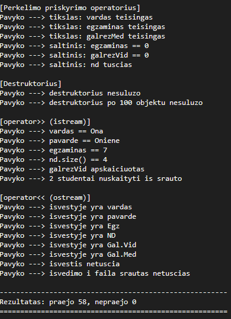

# Studentas klasė v1.2

## Aprašymas

Šiame projekte išplėsta v1.1 versija iki v1.2. Klasė `Studentas` realizuota pagal Rule of Five principą, o taip pat perdengti įvesties ir išvesties operatoriai darbui su studento duomenimis.

Projekto tikslas buvo sukurti pilnai veikiančią, tvarkingai testuotą ir ateityje lengvai panaudojamą `Studentas` klasę.

---

## Projekto struktūra

```
Studentas.h			- class apibrėžimas (v1.1 naujas)
Studentas.cpp		- class realizacija (v1.1 naujas)
konteineris.h		- studentu konteineris<Studentas>
main.cpp
meniu.cpp -- meniu.h
skaitymas.cpp -- skaitymas.h
Generavimas.cpp -- Generavimas.h
spausdinam.cpp -- spausdinam.h
tyrimas.cpp -- tyrimas.h
laikai.cpp -- laikai.h
Makefile
```

---

# Sistemos parametrai

- CPU: 12th Gen Intel Core i5-12400F
- RAM: 32.0 GB (31.8 GB usable)
- Diskas: HDD
- OS: Windows 10

---

## Realizuota funkcionalumo versija v1.2

Pagrindiniai patobulinimai nuo v1.1:

- realizuoti visi Rule of Five metodai;
- realizuoti `operator>>` ir `operator<<`;
- parengtas testų failas visų metodų tikrinimui;

## Studentas klasės paskirtis

Klasė saugo ir apdoroja šiuos duomenis:

| Duomuo | Aprašymas |
|---|---|
| Vardas | Studento vardas |
| Pavardė | Studento pavardė |
| Namų darbai | Namų darbų pažymių vektorius |
| Egzaminas | Egzamino pažymys |
| Vidurkis | Namų darbų vidurkis |
| Galutinis balas pagal vidurkį | Apskaičiuojamas galutinis įvertinimas |
| Galutinis balas pagal medianą | Apskaičiuojamas galutinis įvertinimas |

## Rule of Five realizacija

Klasėje pilnai realizuoti šie specialieji metodai:

| Metodas | Paskirtis |
|---|---|
| Default konstruktorius | Sukuria tuščią objektą |
| Copy konstruktorius | Sukuria objekto kopiją |
| Copy priskyrimo operatorius | Nukopijuoja vieno objekto reikšmes į kitą |
| Move konstruktorius | Perkelia resursus iš vieno objekto į kitą |
| Move priskyrimo operatorius | Perkelia resursus priskyrimo metu |
| Destruktorius | Atlaisvina objekto naudojamus resursus |

## Įvesties ir išvesties operatoriai

Klasėje realizuoti perdengti operatoriai:

| Operatorius | Paskirtis |
|---|---|
| `operator>>` | Nuskaityti studento duomenis iš įvesties srauto |
| `operator<<` | Išvesti studento duomenis į išvesties srautą |

### `operator>>`

Šis operatorius leidžia nuskaityti studento duomenis:
- rankiniu būdu;
- iš failo;
- iš bet kurio `istream` tipo srauto.

---

# Testavimas

Projektui sukurta atskira testavimo sistema (testas.cpp), kuri tikrina visų klasės metodų veikimą.

## Testavimo tikslas

### Patikrinti, ar:
- visi konstruktoriai veikia teisingai;
- kopijavimo ir perkėlimo operacijos veikia korektiškai;
- nėra atminties valdymo klaidų;
- įvesties/išvesties operatoriai veikia teisingai.

| Konstruktorius/operatorius | Kas tikrinama |
|---|---|
| `Default konstruktorius` | Objektas inicializuojamas tuščias |
| `Parametrinis konstruktorius` | Duomenys priskiriami teisingai |
| `Copy konstruktorius` | Sukuriama teisinga kopija |
| `Copy priskyrimas` | Priskyrimas veikia teisingai |
| `Move konstruktorius` | Resursai perkeliami |
| `Move priskyrimas` | Perkėlimas veikia teisingai |
| `Destruktorius` | Objektai sunaikinami be klaidų |
| `operator>>` | Duomenys teisingai nuskaitomi |
| `operator<<` | Duomenys teisingai išvedami |





## Testų paleidimas

Testai paleidžiami iš main.cpp naudojantis funkcija vykdytiTestus(), kai pagr. meniu vartotojas pasirenka 7 pasirinkimą. Programos pabaigoje pateikiama suvestinė:
- Praejo: X
- Nepraejo: Y

(X ir Y yra sveiki skaiciai).

Tai leidžia greitai įvertinti programos korektiškumą.

---

# Kompiliavimas ir paleidimas

## Pagrindiniai
make

## Su optimizavimo flagais
make opt

## Paleidimas
./programa_vector
./programa_list
./programa_deque

##Su flagais:
./programa_vector_O1
./programa_vector_O2
./programa_vector_O3

## Valymas
make clean
