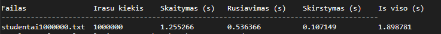
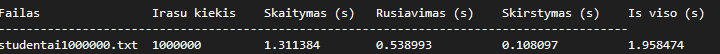

# Studentų duomenų apdorojimo programa v1.1

## Projekto aprašymas

**v1.1** versija sukurta remiantis **v1.0** baze. Pagrindinis pokytis – `struct Stud` pakeista
į pilnavertę `class Studentas`, laikantis gerų OOP praktikų:

- **Privati realizacija**
- **Default konstruktorius**, kad nebūtų "undefined behavior".
- **Inline get'eriai**
- **Pagerinimai** - visas darbo su studento duomenimis logika yra **vienoje vietoje** (`Studentas.h` + `Studentas.cpp`).

---

## Projekto struktūra

```
Studentas.h			- class apibrėžimas (v1.1 naujas)
Studentas.cpp		- class realizacija (v1.1 naujas)
konteineris.h		- studentu konteineris<Studentas>
main.cpp
meniu.cpp -- meniu.h
skaitymas.cpp -- skaitymas.h
Generavimas.cpp -- Generavimas.h
spausdinam.cpp -- spausdinam.h
tyrimas.cpp -- tyrimas.h
laikai.cpp -- laikai.h
Makefile
```

---

# Studentų skirstymo strategijos

### Strategija 1
Iš bendro konteinerio sukuriami **du nauji** – vargšiukai ir protai.

### Strategija 2
Kuriamas tik **vargšiukų** konteineris; vargšiukai ištrinami iš bendro konteinerio, likę = protai.

### Strategija 3 (optimizuota)
Naudojamas `std::partition` – vienas perėjimas, minimalus kopijavimas.

---

# Spartos palyginimas: struct (v1.0) vs class (v1.1)

Testuota su **std::vector**, **Strategija 3** (greičiausia). Testavimas paleistas 10 kartų, rezultatai yra vidurkis.
Kompiliuota be optimizavimo flagų (`g++ -std=c++17`).

### 100 000 įrašų – std::vector, Strategija 3

| Versija | Skaitymas (s) | Rikiavimas (s) | Skirstymas (s) | Iš viso (s) |
|---|---:|---:|---:|---:|
| v1.0 (`struct Stud`) | 0.320635 | 0.144437 | 0.035962 | 0.501034 |
| v1.1 (`class Studentas`) | 0.321670 | 0.143498 | 0.027811 | 0.492979 |

### 1 000 000 įrašų – std::vector, Strategija 3

| Versija | Skaitymas (s) | Rikiavimas (s) | Skirstymas (s) | Iš viso (s) |
|---|---:|---:|---:|---:|
| v1.0 (`struct Stud`) | 1.887719 | 1.974143 | 0.425847 | 4.287709 |
| v1.1 (`class Studentas`) | 1.905067 | 1.874186 | 0.251693 | 4.030946 |

---

# Optimizavimo flagų tyrimas

Kompiliuota su `g++ -std=c++17 -O1/-O2/-O3`.
Testuota: **std::vector**, **Strategija 3**, **studentai1000000.txt**. Testavimas paleistas 10 kartų, rezultatai yra vidurkis.

### Sparta (1 000 000 įrašų, Strategija 3)

| Flag'as | Skaitymas (s) | Rikiavimas (s) | Skirstymas (s) | Iš viso (s) |
|---|---:|---:|---:|---:|
| `-O1` | 1.348002 | 0.542123 | 0.106222 | 1.996347 |
| `-O2` | 1.255266 | 0.536366 | 0.107149 | 1.898781 |
| `-O3` | 1.311384 | 0.538993 | 0.106197 | 1.958474 |

### Exe failo dydis

| Flag'as | Exe dydis (KB) |
|---|---:|
| `-O1` (`programa_vector_O1`) | 2624 |
| `-O2` (`programa_vector_O2`) | 2627 |
| `-O3` (`programa_vector_O3`) | 2657 |






---

# Išvados

- Perėjimas nuo `struct` prie `class` nepablogino spartos, o kai kuriais atvejais ją šiek tiek pagerino.
- Visa logika, susijusi su studento duomenimis, perkelta į vieną vietą – kodas tapo aiškesnis, lengviau palaikomas ir plečiamas.
- `std::vector` + Strategija 3 (`std::partition`) išlieka efektyviausiu sprendimu dideliems duomenų kiekiams.
- `-O2` optimizavimo flagas suteikia geriausią našumą, yra greičiausias pasirinkimas šiai programai.

---

# Sistemos parametrai

- CPU: 12th Gen Intel Core i5-12400F
- RAM: 32.0 GB (31.8 GB usable)
- Diskas: HDD
- OS: Windows 10

---

# Kompiliavimas ir paleidimas

## Pagrindiniai
make

## Su optimizavimo flagais
make opt

## Paleidimas
./programa_vector
./programa_list
./programa_deque

## Su flagais:
programa_vector_O1
programa_vector_O2
programa_vector_O3

## Valymas
make clean
