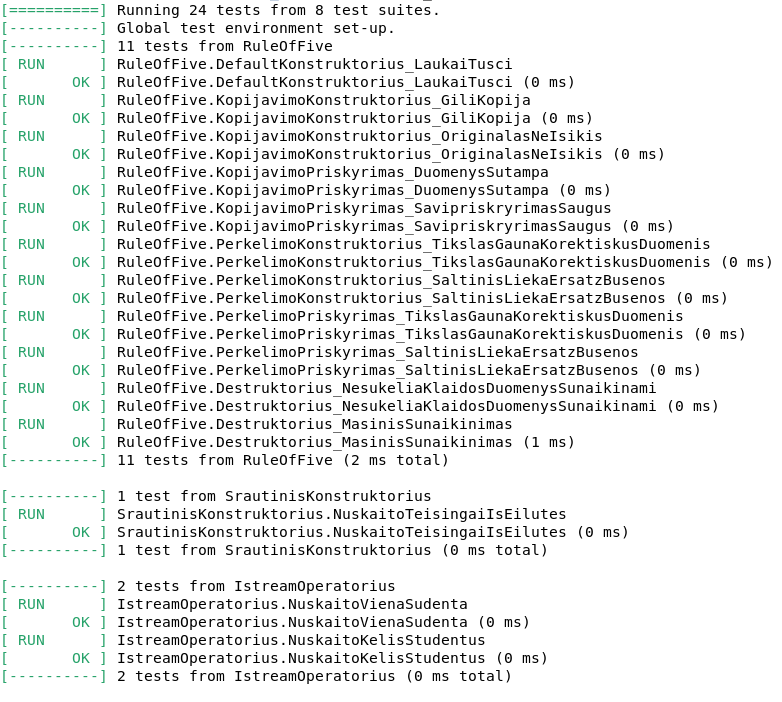
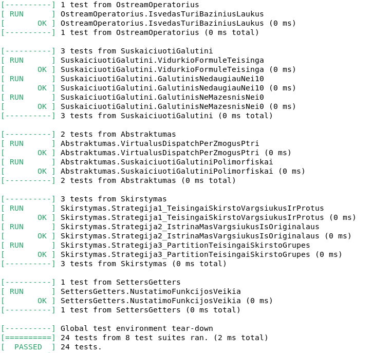

# Studentų duomenų apdorojimo programa v2.0

> Studentų duomenų valdymo sistema su abstrakčia bazine klase, Rule of Five, unit testais ir Doxygen dokumentacija.

---

## Turinys

- [Aprašymas](#aprašymas)
- [Versijų istorija](#versijų-istorija)
- [Projekto struktūra](#projekto-struktūra)
- [Klasių hierarchija](#klasių-hierarchija)
- [Rule of Five](#rule-of-five)
- [Sistemos parametrai](#sistemos-parametrai)
- [Įdiegimas ir kompiliavimas](#įdiegimas-ir-kompiliavimas)
- [Naudojimosi instrukcija](#naudojimosi-instrukcija)
- [Unit testai](#unit-testai)
- [Doxygen dokumentacija](#doxygen-dokumentacija)
- [Konteinerių tyrimas](#konteinerių-tyrimas)

---

## Aprašymas

Projektas realizuoja studentų duomenų valdymo sistemą naudojant C++17.
Pagrindinė klasė `Studentas` paveldi iš abstrakčios `Zmogus` bazės ir
pilnai realizuoja **Rule of Five**. Sistema palaiko tris STL konteinerius
(`vector`, `list`, `deque`) bei tris studentų skirstymo strategijas.

---

## Versijų istorija

### v2.0 (dabartinė)
- Pridėta **Doxygen** dokumentacija visiems header ir source failams
- Realizuoti **Google Test** unit testai (Rule of Five + papildomi)
- Parengtas **CMakeLists.txt** su GTest integracija ir Doxygen palaikymu
- `Zmogus` iškeltas į atskirą abstrakčią bazinę klasę
- Atnaujintas `README.md`

### v1.2
- Realizuoti visi **Rule of Five** metodai `Studentas` klasėje
- Realizuoti `operator>>` ir `operator<<`
- Parengtas vidinis testavimo modulis (`testas.cpp`)
- Testuojamas abstraktumas per `Zmogus*` rodyklę

### v1.1
- `Studentas` išskirta į atskirą klasę (`.h` + `.cpp`)
- Panaudoti `get`/`set` metodai vietoj tiesioginės prieigos
- Pridėtas konteinerių pasirinkimas kompiliavimo metu

### v1.0
- Pradinė versija su `struct Studentas`
- Failo skaitymas ir rašymas
- Trijų STL konteinerių lyginimas
- Trys skirstymo strategijos

---

## Projekto struktūra

```
.
├── main.cpp               # Pagrindinis failas
├── Zmogus.h / .cpp        # Abstrakti bazinė klasė
├── Studentas.h / .cpp     # Konkreti klasė (Rule of Five)
├── konteineris.h          # Kompiliavimo laiku pasirenkamas konteineris
├── Generavimas.h / .cpp   # Generavimas ir skirstymas į grupes
├── skaitymas.h / .cpp     # Duomenų skaitymas
├── spausdinam.h / .cpp    # Rikiavimas ir išvedimas
├── meniu.h / .cpp         # Interaktyvus meniu
├── tyrimas.h / .cpp       # Greitaveikos tyrimas
├── testas.h / .cpp        # Vidinis testavimo modulis (v1.2)
├── laikai.h               # Laiko matavimų struktūra
├── tests/
│   └── unit_tests.cpp     # Google Test unit testai (v2.0)
├── Makefile               # Makefile sistema
├── Makefile               # Alternatyvus Makefile (Unix)
├── Doxyfile               # Doxygen konfigūracija
└── docs/
    ├── refman.pdf
    ├── html/              # HTML dokumentacija
    └── latex/             # LaTeX dokumentacija + PDF
```

---

## Klasių hierarchija

```
Zmogus  (abstrakti)
│   ├── vardas : string
│   ├── pavarde : string
│   ├── getVardas() : string
│   ├── getPavarde() : string
│   ├── suskaiciuotiGalutini() = 0  ← grynoji virtuali
│   └── spausdinti(ostream&) = 0   ← grynoji virtuali
│
└── Studentas  (konkreti)
        ├── egzaminas : int
        ├── nd : vector<int>
        ├── vidurkis : float
        ├── galrezVid : float
        ├── galrezMed : float
        ├── suskaiciuotiGalutini() override
        └── spausdinti(ostream&) override
```

---

## Rule of Five

| Metodas | Realizacija |
|---------|-------------|
| Default konstruktorius | Inicializuoja laukus į 0 / tuščius |
| Kopijavimo konstruktorius | Gili kopija (`nd` vektorius) |
| Kopijavimo priskyrimo op. | Savipriskyrimo apsauga |
| Perkėlimo konstruktorius | Perkelia `nd`; šaltinis lieka tuščias |
| Perkėlimo priskyrimo op. | Savipriskyrimo apsauga + perkėlimas |
| Destruktorius | `= default` (vektorius atlaisvinamas automatiškai) |

### Galutinio balo formulė

```
galrezVid = 0.4 × vidurkis  + 0.6 × egzaminas
galrezMed = 0.4 × mediana   + 0.6 × egzaminas
```

---

## Sistemos parametrai (testavimo aplinka)

| Parametras | Reikšmė |
|------------|---------|
| CPU | 12th Gen Intel Core i5-12400F |
| RAM | 32 GB DDR4 |
| Diskas | HDD |
| OS | Windows 10 |
| Kompiliatorius | GCC / MSVC |

---

## Įdiegimas ir kompiliavimas

### Reikalavimai
- C++17 palaikantis kompiliatorius (GCC ≥ 9, Clang ≥ 10, MSVC 2019+)
- (Neprivaloma) Doxygen + Graphviz – dokumentacijai
- (Neprivaloma) TexLive – PDF generavimui iš LaTeX

### Kompiliavimo instrukcijos

```bash

# Konfigūruoti (numatytasis: vector, su testais)
make ..(programa_vector arba programa_list arba programa_deque)

make opt -- su optimizavimo flagais

make tests -- su google unit testavimu

# Kompiliuoti
make

# Paleisti programą
##Vector
./programa_vector        # Linux/macOS
.\programa_vector      # Windows

##List
./programa_list        # Linux/macOS
.\programa_list      # Windows

##Deque
./programa_deque        # Linux/macOS
.\programa_deque      # Windows

# Valymas
make clean
```

---

## Naudojimosi instrukcija

Paleidus programą, rodomas meniu:

```
Pasirinkite programos eigą:
1 - Įvesti studentą rankiniu būdu
2 - Skaityti iš failo ir iškart apdoroti
3 - Pridėti studentą su atsitiktiniais pažymiais (su vardu)
4 - Pridėti sugeneruotą studentą (auto vardas/pavardė)
5 - Sugeneruoti studentų failą
6 - Atlikti konteinerių ir strategijų tyrimą
7 - Paleisti Studentas klasės testus (v1.2)
8 - Patikrinti abstraktumą
9 - Baigti darbą
```

### Failo formatas

```
Vardas    Pavardė   ND1  ND2  ...  NDn  Egzaminas
Jonas     Jonaitis   8    7    9    6    10
Ona       Onienė     5    6    7         8
```

### Skirstymo strategijos

| Strategija | Aprašymas | Greitis |
|-----------|-----------|---------|
| 1 | Du nauji konteineriai | Lėčiausias |
| 2 | Vargsiukai ištrinami iš originalaus | Vidutinis |
| 3 | `std::partition` | Greičiausias |

---

## Google Unit testavimas

### Testuojami komponentai

| Testas | Aprašymas |
|--------|-----------|
| `RuleOfFive.DefaultKonstruktorius_LaukaiTusci` | Numatytojo kons. tikrinimas |
| `RuleOfFive.KopijavimoKonstruktorius_GiliKopija` | Gili kopija |
| `RuleOfFive.KopijavimoKonstruktorius_OriginalasNeIsikis` | Izoliacijos tikrinimas |
| `RuleOfFive.KopijavimoPriskyrimas_DuomenysSutampa` | Copy assignment |
| `RuleOfFive.KopijavimoPriskyrimas_SavipriskryrimasSaugus` | Self-assignment |
| `RuleOfFive.PerkelimoKonstruktorius_TikslasGaunaKorektiskusDuomenis` | Move konstruktorius |
| `RuleOfFive.PerkelimoKonstruktorius_SaltinisLiekaErsatzBusenos` | Šaltinio būsena po move |
| `RuleOfFive.PerkelimoPriskyrimas_TikslasGaunaKorektiskusDuomenis` | Move assignment |
| `RuleOfFive.PerkelimoPriskyrimas_SaltinisLiekaErsatzBusenos` | Šaltinio būsena |
| `RuleOfFive.Destruktorius_NesukeliaKlaidosDuomenysSunaikinami` | Destruktorius |
| `RuleOfFive.Destruktorius_MasinisSunaikinimas` | 1000 objektų sunaikinimas |
| `IstreamOperatorius.NuskaitoVienaSudenta` | `operator>>` |
| `OstreamOperatorius.IsvedasTuriBaziniusLaukus` | `operator<<` |
| `SuskaiciuotiGalutini.VidurkioFormuleTeisinga` | Formulės tikslumas |
| `Abstraktumas.VirtualusDispatchPerZmogusPtri` | Polimorfizmas |
| `Skirstymas.Strategija1/2/3` | Skirstymo algoritmų tikrinimas |




### Vidinis testavimo modulis (v1.2)

Meniu pasirinkimas `7` paleidžia `vykdytiTestus()` funkciją iš `testas.cpp`.

---

## Doxygen dokumentacija

### Generavimas

```bash
# Iš projekto šaknies:
doxygen Doxyfile
```

Dokumentacija bus sukurta kataloguose:
- `docs/html/index.html` – HTML versija
- `docs/latex/` – LaTeX versija

### PDF generavimas iš LaTeX

```bash
cd docs/latex
make          # Linux/macOS (reikia TexLive)
# Arba naudoti Overleaf: įkelti latex katalogo failus
```

---

## Konteinerių tyrimas

Meniu pasirinkimas `6` atlieka greitaveikos tyrimą:

| Konteineris |
|-------------|
| `std::vector`|
| `std::list`|
| `std::deque`|

Rezultatai išsaugomi `benchmark_<konteineris>_S<strategija>.md` faile.
